  <picture>
    <source media="(max-width: 600px)" srcset="./assets/hero-mobile.svg" />
    
  </picture>

  
  &nbsp;
  
  &nbsp;
  

  <b>Open to internships and opportunities in software &amp; data.</b>

  <a href="#about">About</a> &nbsp; / &nbsp;
  <a href="#selected-work">Selected work</a> &nbsp; / &nbsp;
  <a href="#toolbox">Toolbox</a> &nbsp; / &nbsp;
  <a href="#learning-now">Learning now</a>

 

## About

I'm **Henil**, a Computer Science student at the **University of Alberta**. I enjoy turning ideas into practical software and understanding what happens beneath the surface—from a database query to a web request.

- **Python is my strongest language.** I also work with C, Java, JavaScript, and SQL.
- My interests sit around **backend development, databases, and AI/ML**.
- I learn by building: database applications, Android projects, and cryptography experiments.
- Away from the editor, you'll probably find me playing **Valorant**.

 

## Selected work

<table>
  <tr>
    <td width="50%" valign="top">
      
      <h3>Shopping System CLI</h3>
      
<code>Python</code> <code>SQLite</code> <code>bcrypt</code>

      
A team-built shopping application that connects customer workflows with a relational database.

      <ul>
        <li>Authentication and account management</li>
        <li>Product search, cart, checkout, and order history</li>
        <li>Inventory updates and weekly sales reports</li>
      </ul>
      
<a href="https://github.com/Henil052/Mini-Project-1"><b>Explore the code ↗</b></a>

    </td>
    <td width="50%" valign="top">
      
      <h3>Event Lottery App</h3>
      
<code>Java</code> <code>Android</code> <code>Firestore</code>

      
A collaborative Android project for event registration, waiting lists, and entrant selection.

      <ul>
        <li>Entrant, organizer, and administrator workflows</li>
        <li>QR scanning and waiting-list management</li>
        <li>Firebase integration, unit tests, and UI tests</li>
      </ul>
      
Team project · CMPUT 301

    </td>
  </tr>
  <tr>
    <td width="50%" valign="top">
      
      <h3>Article Analytics</h3>
      
<code>Python</code> <code>MongoDB</code>

      
Queries and analysis that turn an article collection into useful summaries.

      <ul>
        <li>Common-word analysis</li>
        <li>Article counts by date and source</li>
        <li>Recent article retrieval</li>
      </ul>
      
Course project · CMPUT 291

    </td>
    <td width="50%" valign="top">
      
      <h3>Cryptography Lab</h3>
      
<code>Python</code> <code>Cryptanalysis</code>

      
Exploring how ciphers work, how they fail, and how patterns help recover information.

      <ul>
        <li>Caesar, Affine, Vigenère, and transposition ciphers</li>
        <li>RSA and pseudorandom number generation</li>
        <li>Cryptanalysis and language identification</li>
      </ul>
      
Coursework · CMPUT 331

    </td>
  </tr>
</table>

 

## Toolbox

**Languages**

  <picture>
    <source media="(prefers-color-scheme: light)" srcset="./assets/languages-light.svg" />
    
  </picture>

Python · C · Java · JavaScript · SQL · HTML · CSS

**Databases &amp; application development**

  <picture>
    <source media="(prefers-color-scheme: light)" srcset="./assets/data-light.svg" />
    
  </picture>

SQLite · MongoDB · Firebase / Firestore · Android

**Everyday tools**

  <picture>
    <source media="(prefers-color-scheme: light)" srcset="./assets/tools-light.svg" />
    
  </picture>

Git · GitHub · VS Code · Linux

 

## Learning now

| Focus | What I'm exploring |
| :--- | :--- |
| **Modern web architecture** | How browsers, servers, and APIs work together |
| **AI search &amp; planning** | State spaces, pathfinding, and problem solving |
| **Backend &amp; system design** | How application components fit together |
| **Algorithms** | Turning a problem into a clear, efficient solution |

 

<!-- Optional: paste the contribution-animation block from extras/CONTRIBUTIONS.md here after its first successful workflow run. -->

## Let's build something useful

I'm looking for opportunities to contribute, learn from a team, and grow in **software development or data**.

**[Connect on LinkedIn](https://www.linkedin.com/in/henil-patel-a3798a281/)** · **[Send me an email](mailto:henilpatel0502@gmail.com)**

 

  

